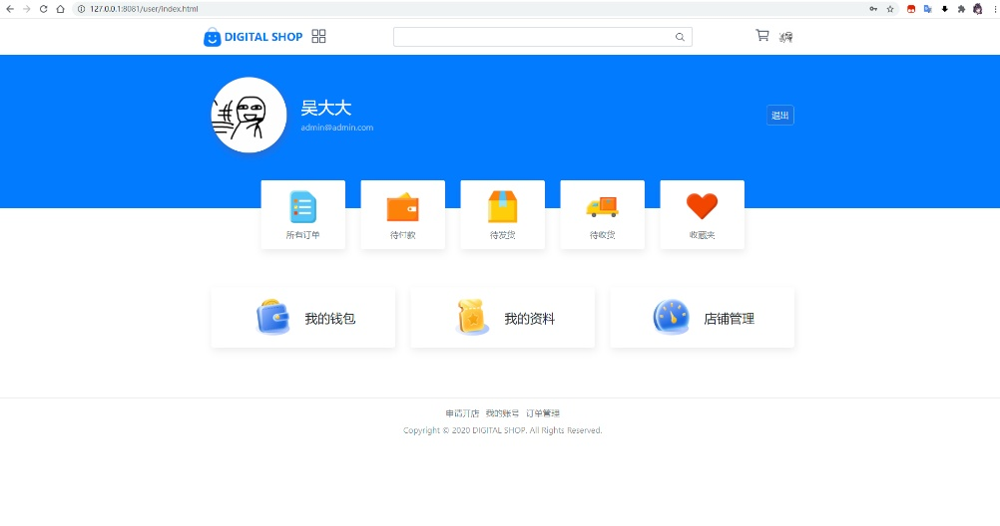
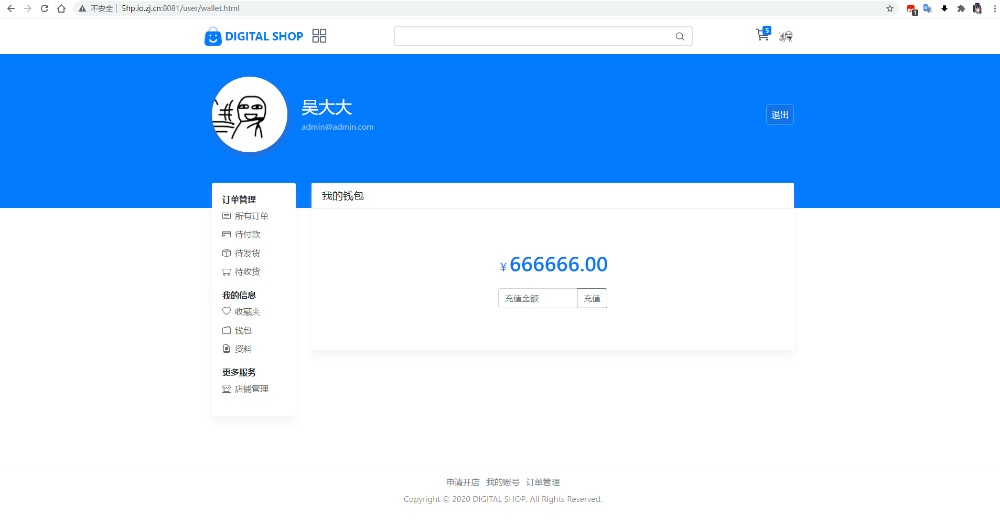
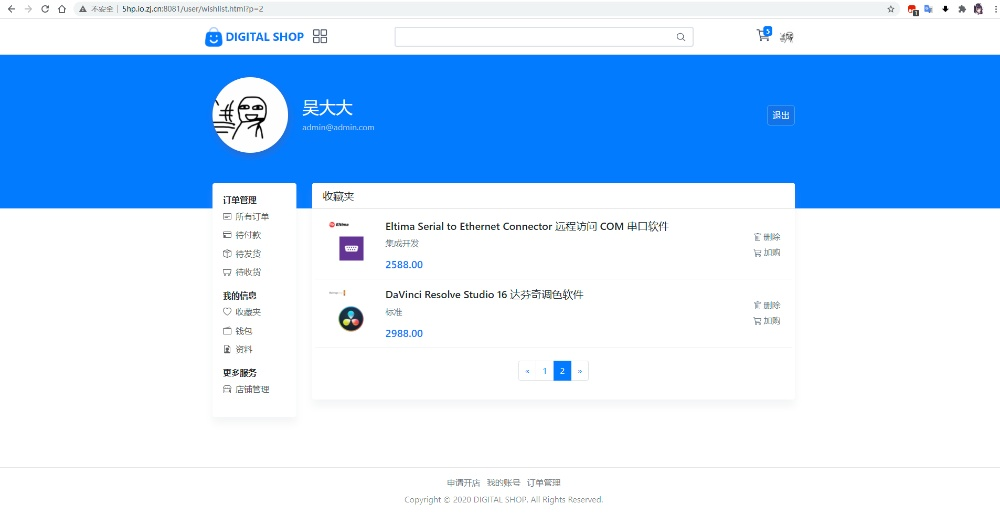
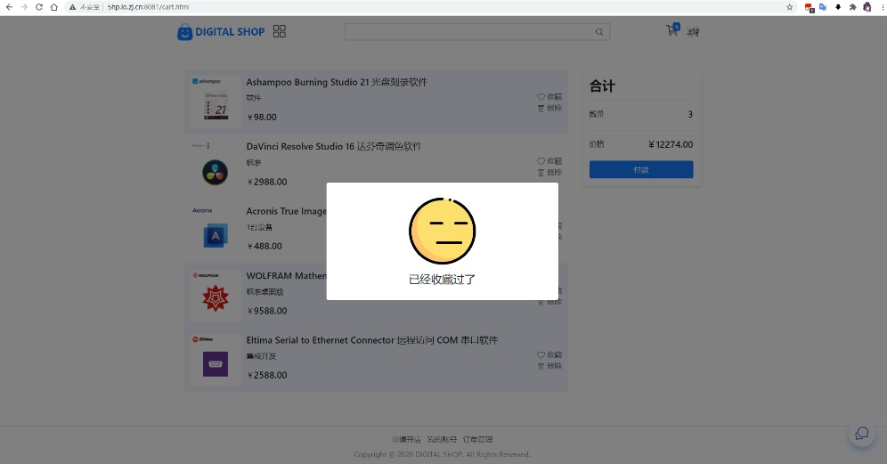
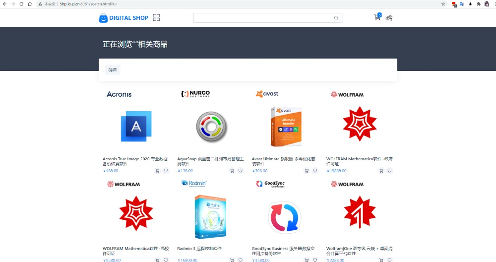
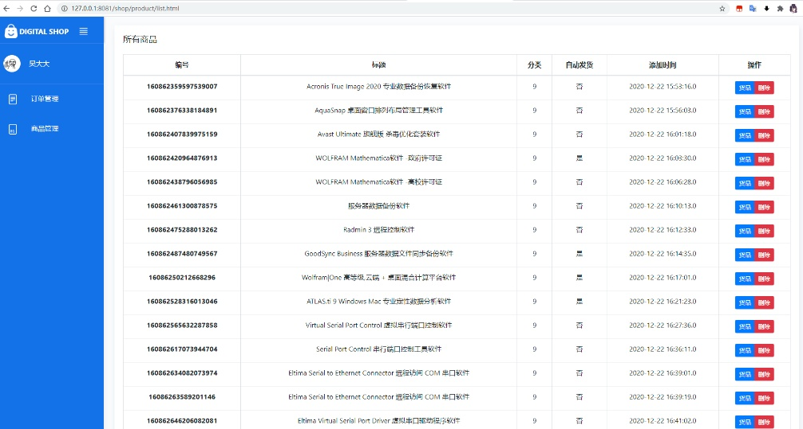
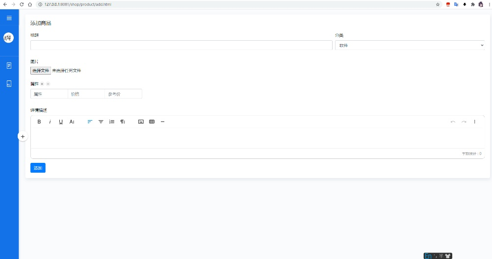

# shop
> SpringBoot+Bootstrap项目，并整合thymeleaf进行页面渲染，实现了邮箱登录，商品搜索，商品筛选与分页，用户权限，收藏夹/购物车，使用支付宝购买商品，商家后台等功能

### 项目背景
大学期间，正在学习使件项目管理

正好临近期末 课程考核内容也正好要做一个互联网金融平台

于是乎，就有了这个项目


### 快速开始
1. 创建数据库,并导入[shop.sql](docs/shop.sql)
2. 完善以下配置文件
```yaml
spring:
  #数据库连接配置
  datasource:
    username: root
    password: 123456
    url: jdbc:mysql://localhost:3306/shop?serverTimezone=Asia/Shanghai&max_allowed_packet=30000000
    driver-class-name: com.mysql.cj.jdbc.Driver
  #邮箱连接配置
  mail:
    username: # 邮箱
    password: # 邮箱授权码
    host: smtp.qq.com
    properties:
      mail:
        smtl:
          ssl:
            enable=true
          
app:
  #支付宝支付配置
  alipay:
    protocol: https
    gatewayHost: openapi.alipaydev.com
    signType: RSA2
    appId: #应用id
    merchantPrivateKey: #私钥
    alipayPublicKey: #公钥
#端口设置
server:
  tomcat:
    max-http-form-post-size: -1
  port: 8081

```
> 支付相关配置可前往[支付宝开放平台](https://www.alipay.com/)申请

3. 运行启动类
```java
package com.web.shop;

import org.springframework.boot.SpringApplication;
import org.springframework.boot.autoconfigure.SpringBootApplication;

@SpringBootApplication
public class ShopApplication {

    public static void main(String[] args) {
        SpringApplication.run(ShopApplication.class, args);
    }

}

```
> 运行前得先使用maven进行项目构建

### 图片预览








